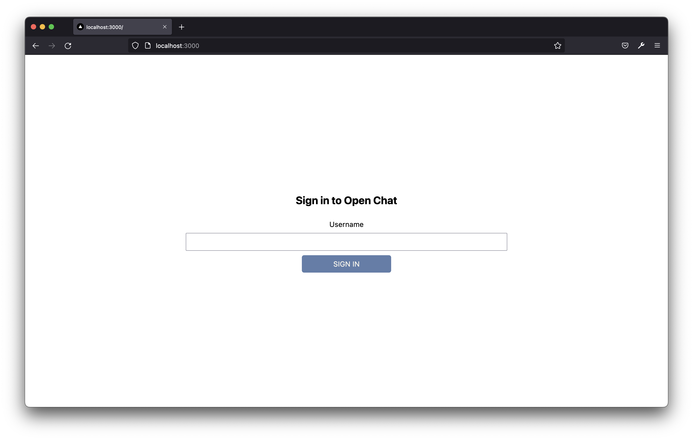

# Chat app

This is a real-time chat app provided by Socket.io to create an application that allows users to send and receive messages from several users on the application. It detects the users who are online, when a user is typing and also sent notification to offline users.

This project was based on the following articles:

- [https://dev.to/novu/building-a-chat-app-with-socketio-and-react-2edj](https://dev.to/novu/building-a-chat-app-with-socketio-and-react-2edj)
- [https://dev.to/novu/building-a-chat-browser-notifications-with-react-websockets-and-web-push-1h1j](https://dev.to/novu/building-a-chat-browser-notifications-with-react-websockets-and-web-push-1h1j)

## Getting Started

Run the development server:

```bash
npm run dev
# or
yarn dev
```

Open [http://localhost:3000](http://localhost:3000) with your browser to see the result.




